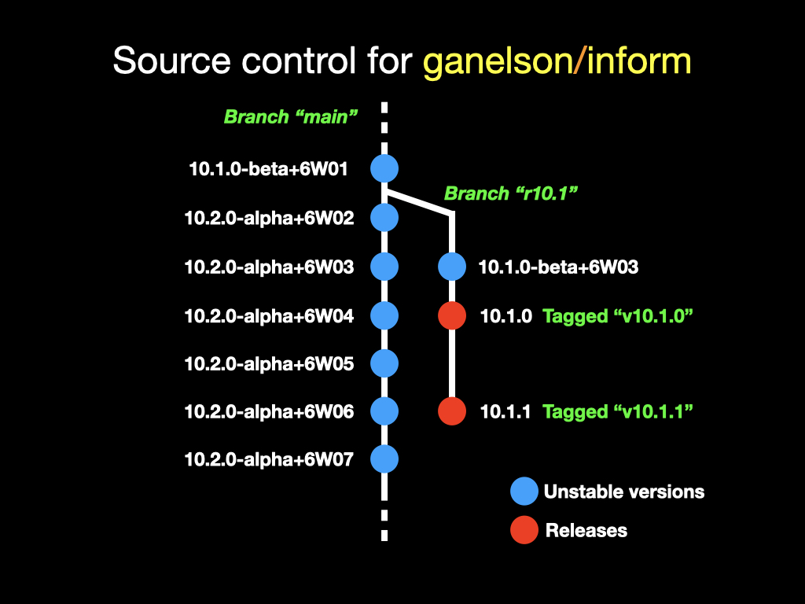

# Branching and versioning policy

## Version numbers for Inform

Inform is developed in public. Command-line users comfortable with git can always get the very latest state. But that potentially means endless different versions of Inform out there in the wild. To clarify this situation, all versions are numbered, and we will distinguish between "release" versions, which are ready for public use, and "unstable" versions, which are not.

"Release" versions have simple version numbers in the shape `X.Y.Z`: for example, `10.1.0`.

"Unstable" versions are commits of the software between releases. These have much longer version numbers, containing an `-alpha` or `-beta` warning. For example, `10.1.0-beta+6V35`. (The `+6V35` is a daily build number, also only
present on version numbers of unstable versions.)

Note that `inform7 -version` prints out the full version number of the core
source it was compiled from. This one is clearly unstable:

	$ inform7/Tangled/inform7 -version
	inform7 version 10.1.0-beta+6V35 'Krypton' (26 July 2022)

(Major versions of Inform were code-named alphabetically with chemical elements:
1 Aluminium, 2 Beryllium, 3 Carbon, 4 Dysprosium, 5 Europium, 6 Fluorine, 7 Gallium, 8 Hydrogen, 9 Iron, 10 Krypton. 11 will be Lithium.)

## State of play in August 2022

Altogether 30 release versions of Inform were issued in the period 2006-22,
but that was before the software moved to Github, and so those are not available
as Releases in this repository. See [notes/version_history.md](notes/version_history.md) for the full catalogue.

So this repository currently contains only unstable versions. The first release
version of the open-source age, `10.1.0`, will be made in early August 2022.

Going forward, we will mostly not provide binaries of the apps for unstable versions - only for releases.

## What semver means for Inform

The `X.Y.Z` numbers represent a _pragmatic_ form of semantic versioning, or "semver". See [semver.org](semver.org) for more, but briefly, this is an 
Internet standard for how to assign software version numbers.

Strict compliance with semver is good for software used as component parts
widely shared with other coders, but less persuasive with large umbrella
projects such as programming languages or operating systems. (On a strict
reading of semver, such projects would never have minor versions at all.)
The plan for Inform is to be more pragmatic. The numbers `X`, `Y` and `Z`
are the `MAJOR`, `MINOR` and `POINT` versions, and:

- if a release withdraws any significant functionality or syntax, or significantly changes how an existing feature works, the `MAJOR` number must increase;

- if any functionality or syntax is added, or a not very significant change is made to an existing feature in a way which probably won't cause anybody problems, the `MINOR` number must increase;

- if the only changes are bug fixes, only the `POINT` number increases.

## Branching

In the core Inform repository, active development is on the `main` branch, at least for now. That will always be a version which is unstable. All releases will be made from short branches off of `main`. For example, there will soon be a branch called `r10.1`. This will contain as few commits as possible, ideally just one, which would be the actual release version of 10.1.0. But if there are then point updates with bug fixes, say 10.1.1, 10.1.2, and so on, those would be further commits to the `r10.1` branch. Later, another short branch from `main` would be `r10.2`.

Releases will be tagged with their version numbers, so the commit representing 10.1.0 will be tagged `v10.1.0`. These will be presented under Releases in the usual Github way, from the column on the right-hand side of the home page. We expect to provide the app installers as associated binary files on those releases, though that won't be the only place they are available.
